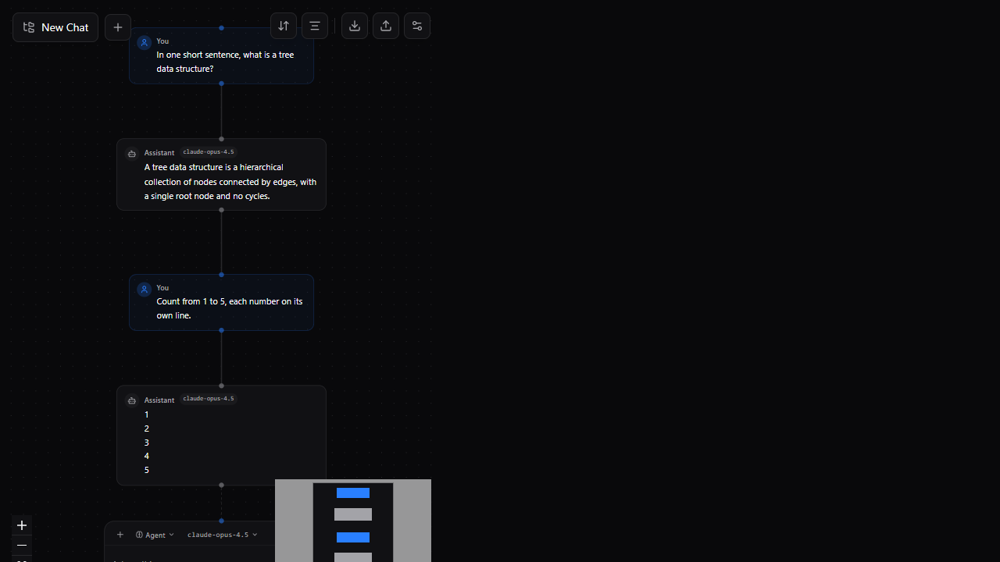
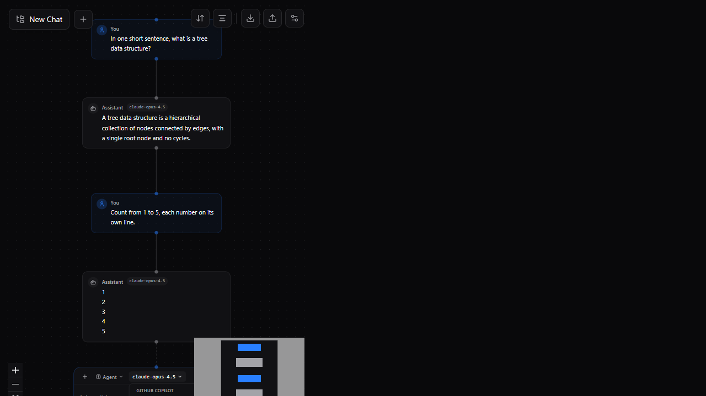
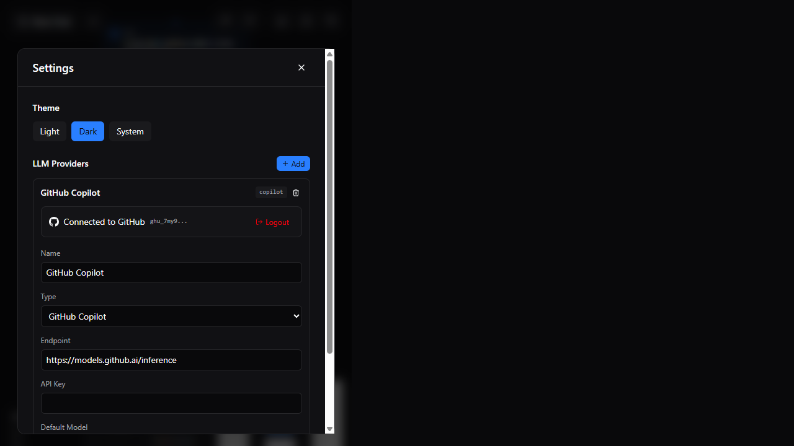

# ChatGraph

A tree-based LLM chat interface. Instead of a single linear conversation, ChatGraph renders every message as a node on an interactive canvas — so you can **fork** any point, explore alternative branches, and compare responses side by side.

Built with React 19, TypeScript, Vite, [@xyflow/react](https://reactflow.dev/) for the graph, and [Dagre](https://github.com/dagrejs/dagre) for automatic layout. It talks to **GitHub Copilot** (via the OAuth device flow), **Ollama**, and **llama.cpp**.

## Screenshots

### Conversation graph
Every prompt and response is a node. Leaves get an inline input box so you can continue any branch.



### Live model picker
Models are fetched dynamically from your connected provider — including Claude, GPT, and Gemini families offered by Copilot.



### Settings & provider connection
Connect GitHub Copilot with a one-click device-flow login, switch themes, and manage providers.



## Features

- **Branching conversations** — fork, duplicate-and-edit, or edit any node in place.
- **Automatic layout** — Dagre keeps the tree tidy; a one-click "snap to layout" re-aligns after manual dragging.
- **Live streaming** — responses stream token-by-token directly into their node.
- **Multiple providers** — GitHub Copilot, Ollama, and llama.cpp, each with dynamically fetched model lists.
- **GitHub Copilot via device flow** — the same OAuth flow VS Code uses; no personal access token needed.
- **Per-leaf input** — start a new message from any point in the tree.
- **Import / export**, **light / dark / system themes**, and a **minimap** for navigation.

## Getting started

```bash
pnpm install
pnpm dev
```

Open http://localhost:5173.

### Connect GitHub Copilot

1. Open **Settings** (top-right toolbar) → expand **GitHub Copilot**.
2. Click **Connect GitHub Copilot**.
3. Enter the shown device code at [github.com/login/device](https://github.com/login/device) and authorize.
4. The model picker populates with the models your Copilot plan offers.

> Requires an active GitHub Copilot subscription.

### Scripts

| Command | Description |
| --- | --- |
| `pnpm dev` | Start the Vite dev server (with API proxies). |
| `pnpm build` | Type-check and build for production. |
| `pnpm preview` | Preview the production build. |
| `pnpm lint` | Run Oxlint. |

## How Copilot access works

Browsers can't call the GitHub / Copilot APIs directly (CORS), so the Vite dev server proxies them:

| Proxy path | Target | Purpose |
| --- | --- | --- |
| `/api/github-login` | `github.com` | OAuth device flow (request code, poll for token) |
| `/api/copilot-token` | `api.github.com/copilot_internal/v2/token` | Exchange the OAuth token for a short-lived Copilot token |
| `/api/copilot` | `api.githubcopilot.com` | Chat completions + model list |
| `/api/ollama` | `localhost:11434` | Local Ollama |
| `/api/llamacpp` | `localhost:8080` | Local llama.cpp |

The flow: **device-flow OAuth token → exchanged for a Copilot token → used against `api.githubcopilot.com`**. This mirrors how the official VS Code Copilot extension authenticates. (The older `models.github.ai` "GitHub Models" API is retired and no longer used.)

## Project structure

```
chatgraph/
├─ index.html
├─ vite.config.ts            # Dev server + API proxies (Copilot, Ollama, llama.cpp)
├─ package.json
├─ docs/
│  └─ screenshots/           # Images used in this README
├─ public/
└─ src/
   ├─ main.tsx               # App entry
   ├─ App.tsx                # Root layout
   ├─ index.css              # Tailwind v4 theme (oklch), light/dark tokens
   ├─ components/
   │  ├─ ChatFlow.tsx        # Main graph: tree → nodes/edges, layout & live-stream sync
   │  ├─ Toolbar.tsx         # Tree selector, layout controls, import/export, settings
   │  ├─ SettingsPanel.tsx   # Theme + provider management
   │  ├─ GitHubLogin.tsx     # Copilot OAuth device-flow UI
   │  ├─ nodes/
   │  │  ├─ PromptNode.tsx   # User message node
   │  │  ├─ ResponseNode.tsx # Assistant message node (streams markdown)
   │  │  └─ InputNode.tsx    # Inline composer at each leaf (mode + model picker)
   │  └─ ui/
   │     └─ Tooltip.tsx      # Radix tooltip wrapper
   ├─ services/
   │  ├─ chat-service.ts     # sendMessage / regenerate orchestration + context building
   │  ├─ auth/
   │  │  └─ github.ts        # Device flow + token storage
   │  └─ llm/
   │     └─ providers.ts     # Provider abstraction (chat streaming + listModels)
   ├─ store/
   │  ├─ chat-store.ts       # Zustand store (trees, nodes, providers, settings)
   │  └─ index.ts            # Store exports
   ├─ types/
   │  └─ chat.ts             # Shared types
   └─ utils/
      └─ layout.ts           # Dagre layout with per-node-type widths
```

## Tech stack

- **UI:** React 19, TypeScript, Tailwind CSS v4
- **Graph:** `@xyflow/react`, `@dagrejs/dagre`
- **State:** Zustand (with `persist` to `localStorage`)
- **Markdown:** `react-markdown` + `remark-gfm` + `rehype-highlight`
- **Build:** Vite

